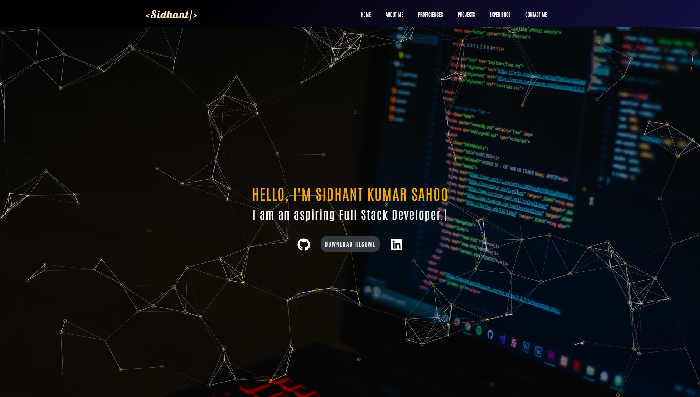

### Hi there 👋, I'm Sidhant

#### I am a Full Stack Developer

Dedicated full stack developer. Capable of writing production-ready code using React.js, Redux, and CSS on the frontend, NodeJS and Express on the backend to build single page applications. Passionate about coding and strongly interested in working in a product based company.

- 🌱 I’m currently Full Stack Web Develoment
- 📫 How to reach me: sidhant1593@gmail.com

### 🛠 &nbsp;Primary Skills

        
        
        
        
        
        
        
        
        
        
        
        

### 🛠 &nbsp;Secondary Skills

        
        
        
        
        

<h3 align="left">Connect with me:</h3>

        
        
        
        
        
        
        
        
        
        
        
        

  

  

